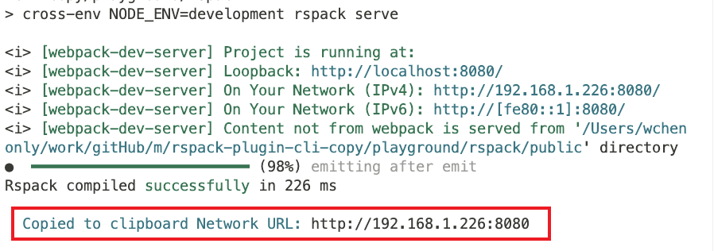
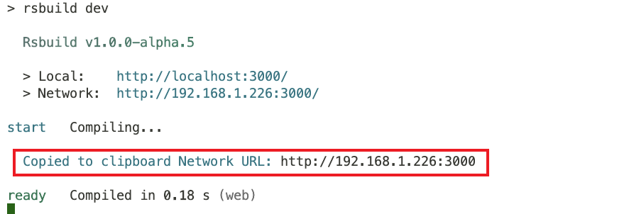

<h1 align="center">rspack-plugin-cli-copy</h1>
<p align="center">启动项目并自动复制终端的网络 URL</p>

<p align="center">
<a href="https://www.npmjs.com/package/rspack-plugin-cli-copy" target="__blank"></a>
<a href="https://www.npmjs.com/package/rspack-plugin-cli-copy" target="__blank"></a>
</p>

简体中文 | [English](./README.md)


## 安装

```bash
npm install rspack-plugin-cli-copy -D

pnpm add rspack-plugin-cli-copy -D
```

## 使用

### rspack 配置

- rspack.config.ts

```js
import { defineConfig } from '@rspack/cli'
import { rspackCliCopyPlugin } from 'rspack-plugin-cli-copy'

export default defineConfig({
  plugins: [new rspackCliCopyPlugin()]
})
```



### rsbuild 配置

- rsbuild.config.ts

```ts
import { defineConfig } from '@rsbuild/core'
import { rsbuildCliCopyPlugin } from 'rspack-plugin-cli-copy'

export default defineConfig({
  plugins: [rsbuildCliCopyPlugin()]
})
```


